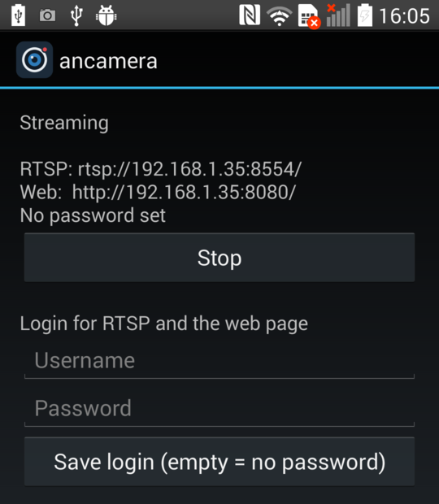
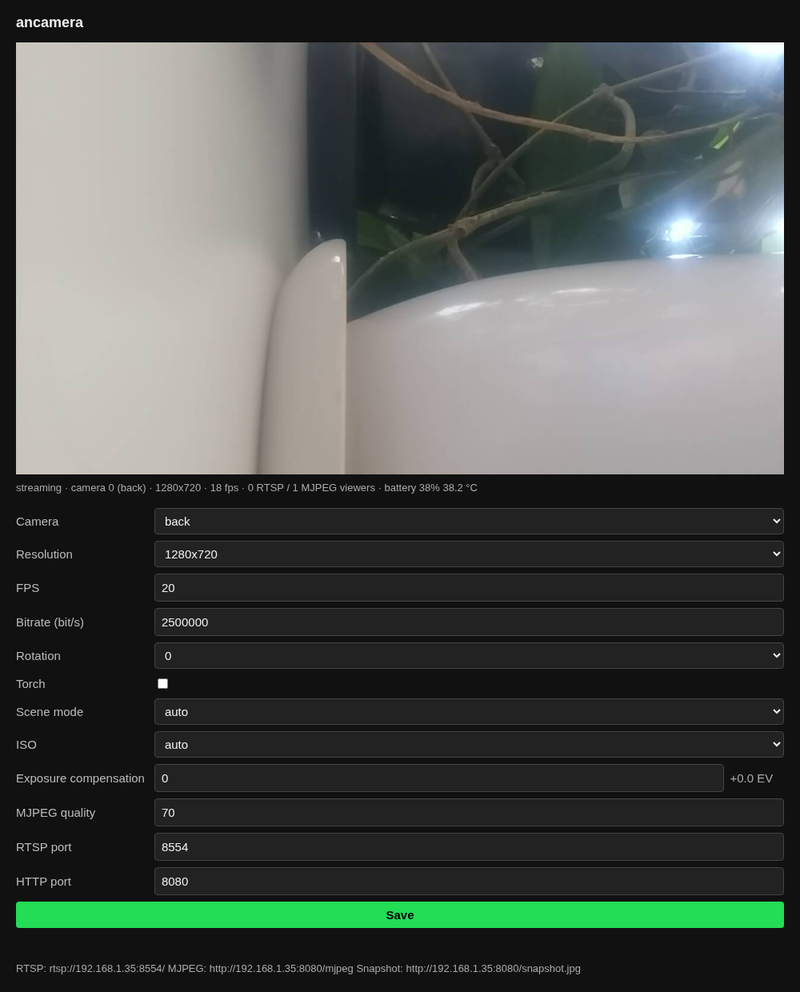

# ancamera

Turn an old Android phone (Android 4.4+) into a LAN monitoring camera.

- **RTSP (H.264, video only):** `rtsp://<phone-ip>:8554/`, for VLC, ffmpeg, Frigate, Home Assistant, Blue Iris.
- **Web page:** `http://<phone-ip>:8080/`, with a live view and camera settings.
- **MJPEG:** `http://<phone-ip>:8080/mjpeg?fps=5` (maximum 15 fps).
- **Snapshot:** `http://<phone-ip>:8080/snapshot.jpg`.
- **Status and settings API:** `GET /api/status`, `GET /api/settings`, `POST /api/settings` (partial JSON).

Tested only on an LG G3. Other phones can behave differently.

<p>
  
  
</p>

## Use

1. Download the APK from [Releases](https://github.com/jestemkojak/ancamera/releases), or build it (see [Build](#build)). Install it and open **ancamera**.
2. Optional: set a username and password. RTSP and the web page then need them (`rtsp://user:pass@<phone-ip>:8554/`).
3. Push **Start**. The stream continues when the screen is off. Keep the phone on a charger.
4. Open the web page to change the camera, resolution, fps, bitrate, rotation, torch, scene mode, ISO or exposure compensation.

In low light the camera lowers the frame rate. A fixed `iso` (for example `ISO800`) or a negative `exposureCompensation` keeps it higher, with a noisier or darker picture. The effect of a `sceneMode` such as `sports` depends on the phone. On the LG G3 it does not change the exposure. The web page shows only the values that the camera supports.

The first password can be set only on the phone. After that, the web page can change it.

The web server accepts only LAN clients, but the RTSP server does not filter addresses, so keep the phone on a private network.
There is no TLS. Basic auth sends the username and password without encryption, so other devices on the network can read them.

### Low-latency viewing

VLC keeps 1 s of network cache by default, so its picture is late. For less lag, use ffplay:

```bash
ffplay -fflags nobuffer -flags low_delay -framedrop -rtsp_transport tcp rtsp://<phone-ip>:8554/
```

In VLC, set a smaller cache:

```bash
vlc --network-caching=150 rtsp://<phone-ip>:8554/
```

## Build

Needs the Android SDK with platform 37 and JDK 21.

```bash
./gradlew assembleDebug testDebugUnitTest
```

### Release

1. Increase `versionCode` and `versionName` in `app/build.gradle.kts`.
2. Push a tag that matches `versionName`, for example `git tag v0.1.0 && git push origin v0.1.0`.

The `Release APK` workflow then builds a signed APK and publishes a GitHub release.
It gets the key from the repository secrets `ANCAMERA_KEYSTORE_BASE64`, `ANCAMERA_KEYSTORE_PASSWORD`, `ANCAMERA_KEY_ALIAS` and `ANCAMERA_KEY_PASSWORD`.
Keep a backup of the keystore. Without the same key, a new APK cannot update an installed one.

## Test on a device

```bash
scripts/device-test.sh <adb-serial>   # end-to-end checks through adb port forwarding
scripts/soak.sh <adb-serial> 30 <phone-wifi-ip>   # 30 minutes with the screen off, over Wi-Fi
```

For the real soak test, give the phone's Wi-Fi IP. Without it, `soak.sh` reads the streams through adb port forwarding, and the test does not use Wi-Fi.
`soak.sh` writes the ffmpeg errors and progress, the app status once a minute, and the phone log to a new directory, and shows its path.

Do not use an API 19 emulator for video tests: its H.264 encoder does not work.
Design: `docs/superpowers/specs/2026-09-25-ancamera-design.md`.

## License

MIT. See [LICENSE](LICENSE).
